# MegaBurguer

O **MegaBurguer** é um aplicativo de PDV (Ponto de Venda) desenvolvido em **Kotlin** com **Firebase**, voltado para agilizar o **atendimento e a gestão de pedidos** em uma hamburgueria local.
O objetivo do app é conectar o salão (garçons) diretamente à cozinha através de sincronização em tempo real e automação de impressão, eliminando comandas de papel e reduzindo erros.

---

## 🛠️ Funcionalidades

### 👤 Perfil Administrador (Gerente)
- **Gestão de Usuários:** Cadastro completo de funcionários com níveis de acesso (Garçom, Cozinha/Caixa, Admin).
- **Segurança:** Funcionalidade de exclusão de usuários e **reset de senha** (envio de link de recuperação via e-mail).
- **Gestão de Mesas:** Criação e exclusão dinâmica de mesas no salão.
- **Cardápio Digital:** Adição, edição e remoção de produtos em tempo real (com upload de imagens).

### 👤 Perfil Garçom (Atendente)
- **Lançamento de Pedidos:** Seleção de mesa, adição de itens ao carrinho e inserção de observações personalizadas antes do envio à cozinha.

### 👤 Perfil Cozinha/Caixa (Balcão)
- **Monitoramento em Tempo Real:** A tela atualiza automaticamente ao receber novos pedidos.
- **Impressão Automática:** O sistema detecta novos pedidos e imprime a via de preparo sem intervenção manual.
- **Fechamento de Conta:** Seleção da mesa do cliente e impressão de cupom não-fiscal com duas vias (Via do Estabelecimento e Via do Cliente).
- **Relatórios:** Visualização e impressão do **Extrato do Dia** (total de vendas).

---

### 🍽️ Fluxo de Pedidos e Impressão Inteligente
- **Sincronização Realtime:** Pedidos lançados pelo garçom aparecem instantaneamente na tela da cozinha.
- **Impressão Automática:** Assim que o pedido é enviado para a cozinha, a impressora térmica imprime automaticamente a comanda de preparo.
- **Impressão Manual:** A via do cliente (Notinha/Cupom com CNPJ) e a via do estabelecimento são impressas apenas mediante acionamento do botão "Imprimir", evitando desperdício de papel.

---

## 🚀 Tecnologias e Arquitetura

O projeto foi construído seguindo os princípios da **Clean Architecture** para garantir escalabilidade e testabilidade.

| Tecnologia | Utilização no Projeto |
|-------------|--------|
| **Kotlin** | Linguagem nativa principal |
| **Clean Architecture** | Separação em camadas (Domain, Data, Presentation) |
| **MVVM** | Padrão de projeto para a camada de apresentação |
| **Firebase Realtime Database** | Banco de dados NoSQL para comunicação em tempo real |
| **Firebase Auth** | Sistema de Login e Recuperação de Senha |
| **Coroutines & Flow** | Processamento assíncrono e reativo de dados |
| **LiveData** | Observação de dados na UI |
| **Navigation SafeArgs** | Navegação segura entre fragmentos com passagem de argumentos |
| **ViewBinding** | Manipulação segura de views XML |

---

## 🖨️ Integração com Hardware (Bluetooth)

Um dos maiores desafios técnicos do projeto foi a integração direta com impressoras térmicas via Bluetooth.
Utilizando a biblioteca **[ESCPOS-ThermalPrinter-Android](https://github.com/DantSu/ESCPOS-ThermalPrinter-Android)**, foi implementada uma classe utilitária (`PrinterHelper`) capaz de:

- Detectar dispositivos pareados;
- Gerenciar conexão socket bluetooth;
- Formatar bytes brutos para comandos ESC/POS;
- Diferenciar fluxos de impressão (Automático para Cozinha vs Manual para Fechamento).

---

## 📱 Telas Iniciais

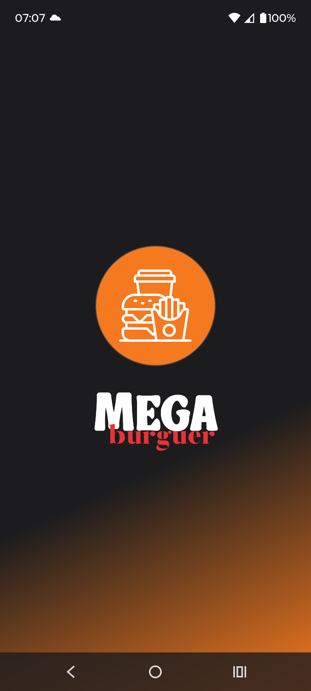
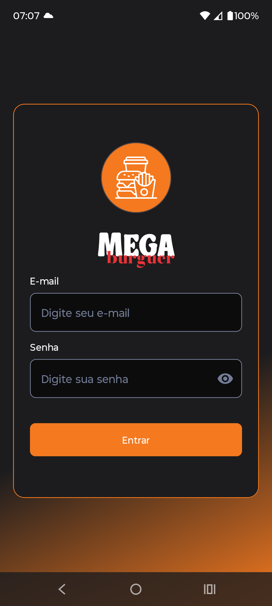

## 📱 Telas do Admin

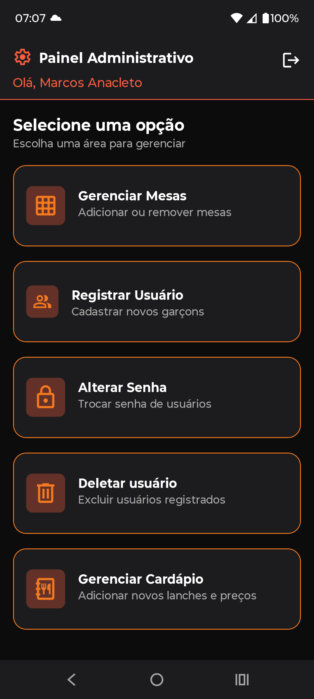
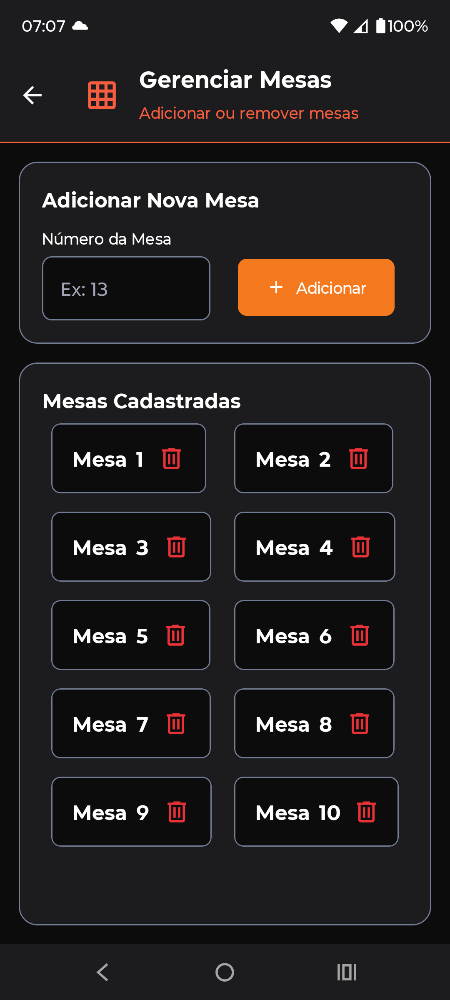
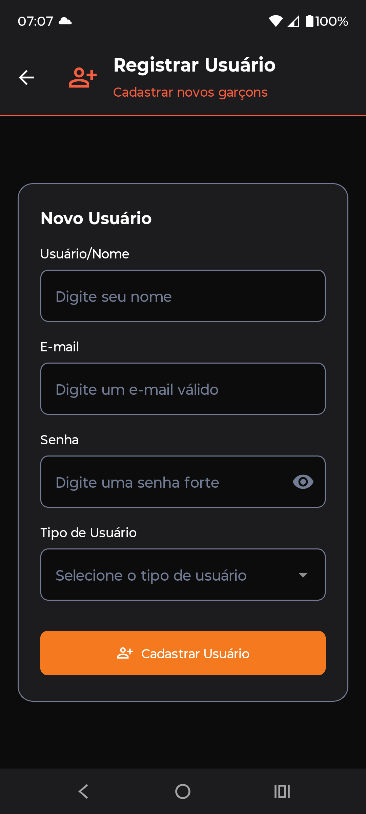
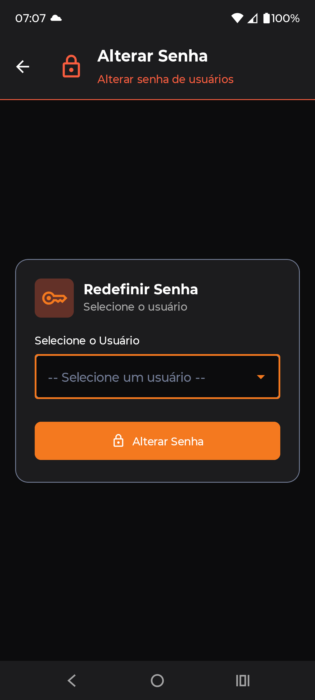
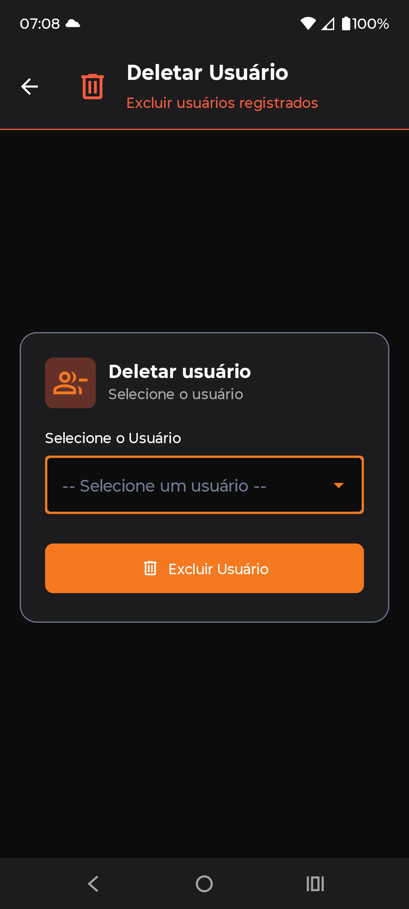
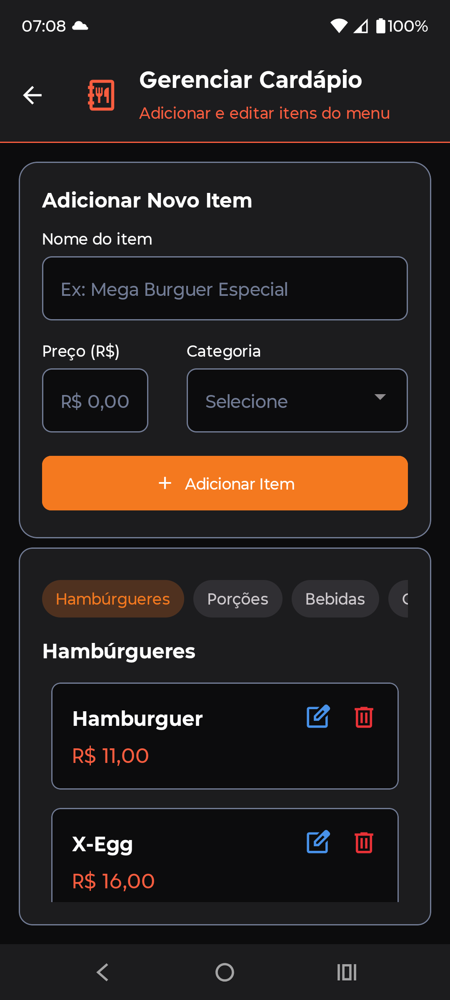

## 📱 Telas do Garçom

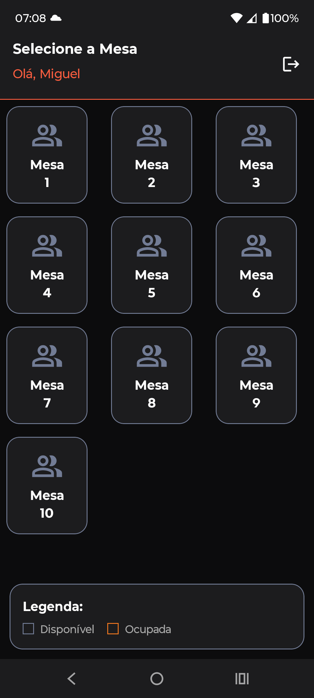
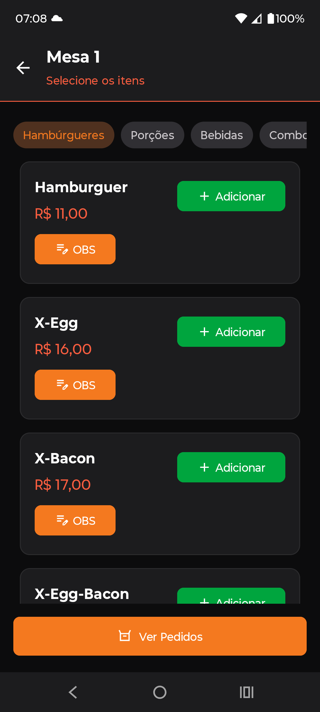
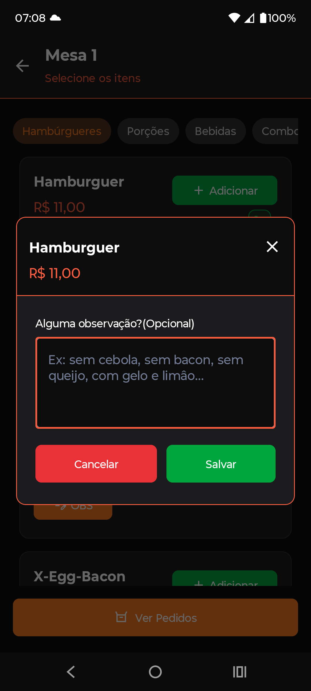

## 📱 Telas da Cozinha/Caixa

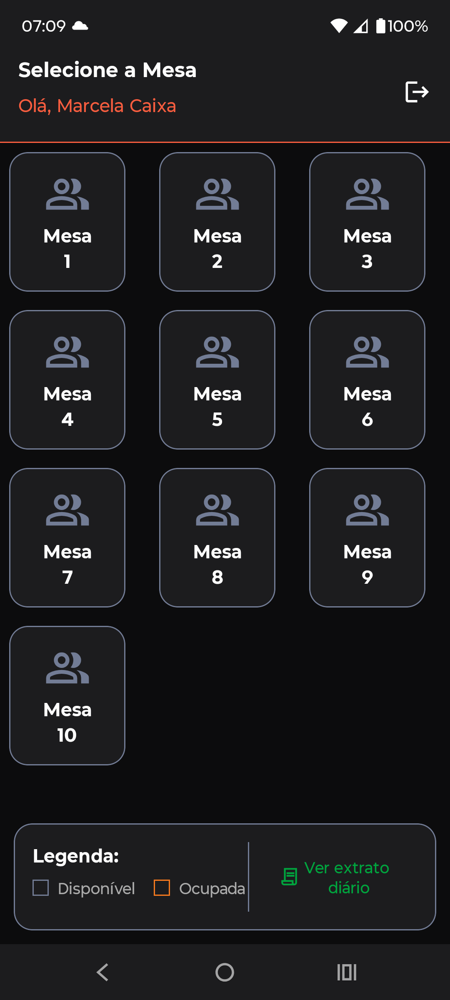
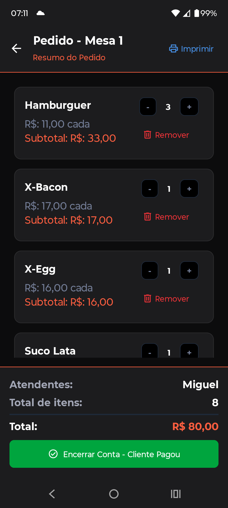
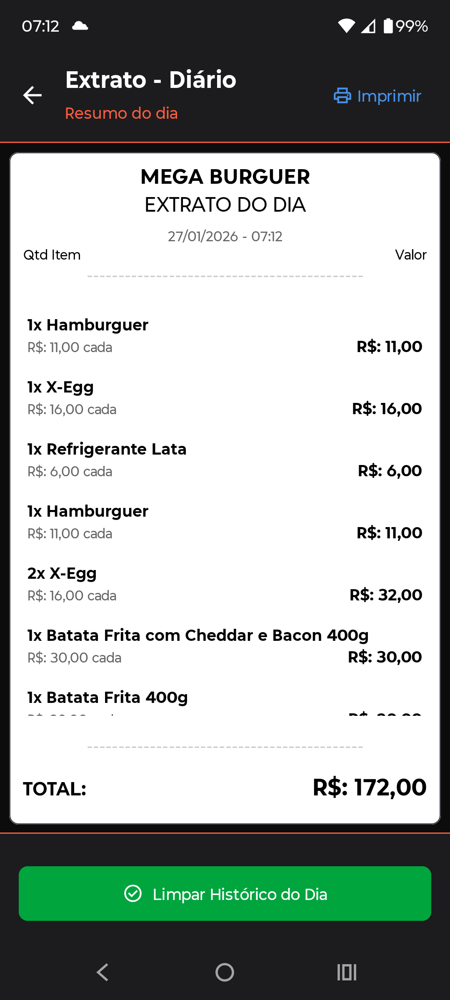

---

## Sobre o Projeto

O **MegaBurguer** é um produto real, desenvolvido para atender a demanda de um estabelecimento comercial que necessitava digitalizar seus processos.

O projeto consolidou conhecimentos avançados de **Android Nativo**, focando não apenas em "fazer funcionar", mas em criar uma estrutura de código profissional (**Clean Code**) preparada para manutenção e expansão futura.

---

## Desenvolvido por:

**Marcos Anacleto**

Formado em **Análise e Desenvolvimento de Sistemas**
Cursando **Tecnologia em Desenvolvimento de Aplicativos Móveis - Unicesumar**
Foco em **Desenvolvimento Android Nativo com Kotlin**

[LinkedIn](https://www.linkedin.com/in/marcos-anacleto-5660a7208/) | [GitHub](https://github.com/MarcosAnacleto24)
